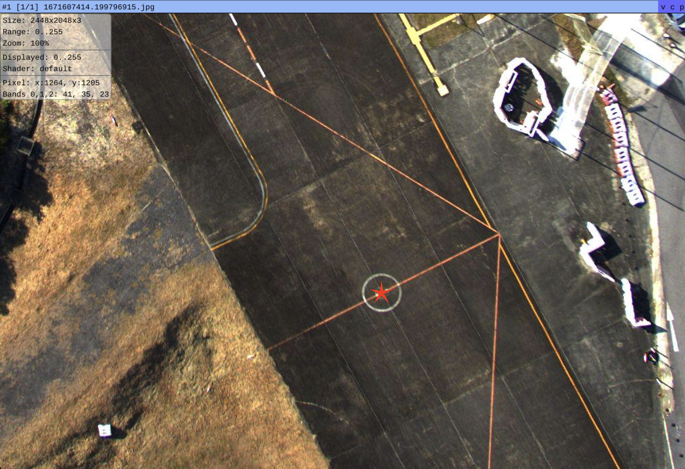
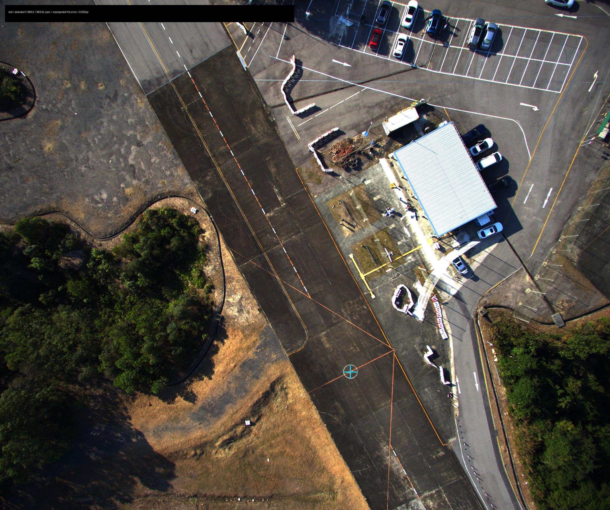
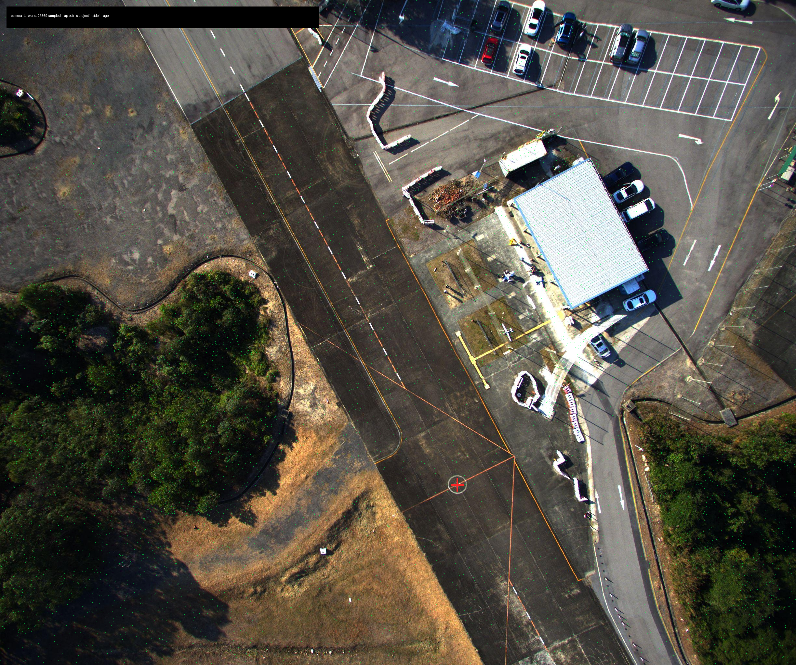
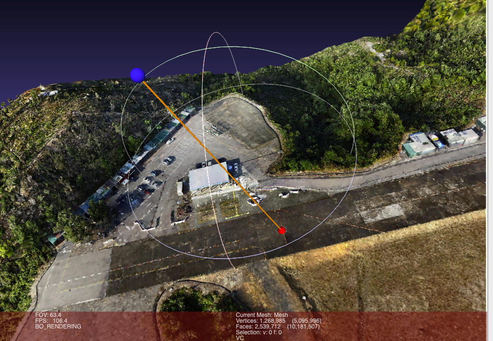

# 2D Pixel To 3D Drone Model Projection

This repo is a small 3D computer vision learning project. The goal is to take a manually selected pixel in a drone image and project it onto a reconstructed 3D model.

The first experiment uses the UAVScenes / MARS-LVIG drone dataset and a DJI Terra reconstruction. Given one image point `(u, v)`, the pipeline computes the corresponding 3D point on `Mesh.ply`, then verifies the result with image reprojection, point-cloud overlay, and MeshLab visualization.

## Project Goal

Given:

```text
image frame: 1671607414.199796915.jpg
selected pixel: u = 1406, v = 1493
camera metadata: intrinsics + pose from sampleinfos_interpolated.json
3D model: terra_3dmap_pointcloud_mesh/HKairport/Mesh.ply
```

Compute:

```text
3D point on the reconstructed model
```

This is the core geometry:

```text
2D pixel -> camera ray -> world/map ray -> ray-mesh intersection -> 3D point
```

## Dataset

The data comes from:

- MARS-LVIG: <https://mars.hku.hk/dataset.html>
- UAVScenes on Hugging Face: <https://huggingface.co/datasets/sijieaaa/UAVScenes>
- UAVScenes GitHub: <https://github.com/sijieaaa/UAVScenes>

The local experiment expects these dataset folders:

```text
interval5_HKairport03/
terra_3dmap_pointcloud_mesh/HKairport/
```

Important files:

```text
interval5_HKairport03/sampleinfos_interpolated.json
interval5_HKairport03/interval5_CAM/1671607414.199796915.jpg
terra_3dmap_pointcloud_mesh/HKairport/Mesh.ply
terra_3dmap_pointcloud_mesh/HKairport/cloud_merged.ply
```

Large dataset files are not meant to be committed to GitHub.

## What The Files Mean

`Mesh.ply` is a triangle mesh reconstructed from the drone scan. It is used for ray-surface intersection.

`cloud_merged.ply` is a dense colored point cloud. It is used for visual verification by projecting map points back into the image.

`sampleinfos_interpolated.json` contains per-frame camera metadata, including:

```text
OriginalImageName
T4x4 camera pose transform
P3x3 camera intrinsic matrix
K1, K2, K3, P1, P2 distortion coefficients
Width, Height
```

## Method

For the selected image point:

```text
u = 1406
v = 1493
```

the pipeline does the following:

1. Load the matching frame metadata from `sampleinfos_interpolated.json`.
2. Convert the pixel into normalized camera coordinates.
3. Convert the normalized camera point into a 3D camera ray.
4. Transform the ray into the 3D map/world coordinate system.
5. Intersect the ray with `Mesh.ply` using Open3D raycasting.
6. Save the 3D result and verification images.

The result from the current experiment is:

```text
hit_point_world = [-93.03814542, -21.38532670, -79.91592292]
hit_distance_from_camera = 78.883636
mesh_triangle_id = 5755287
```

## Results

### Selected 2D Point

The selected point is the center of a visible circular road marking:



### Same-Frame Reprojection

After projecting the pixel to 3D, the 3D point is projected back into the original image. The red point is the selected pixel and the cyan point is the reprojected 3D hit.



The same-frame reprojection error is approximately:

```text
0 px
```

This verifies that the backprojection and reprojection math are internally consistent.

### Point-Cloud Overlay

To verify the camera pose convention, sampled 3D points from `cloud_merged.ply` are projected into the selected image.



The current run compares two possible transform conventions:

```text
camera_to_world: 27869 / 250000 sampled points inside image
world_to_camera: 13395 / 250000 sampled points inside image
```

The `camera_to_world` convention is used as the default for this experiment.

### MeshLab Visualization

The pipeline exports a small debug mesh for MeshLab:

```text
outputs/projection_1671607414_199796915_u1406_v1493/04_meshlab_debug_markers.ply
```

It contains:

```text
red sphere = projected 3D point
blue sphere = camera center
orange cylinder = camera ray
```

Example MeshLab inspection:



## Installation

This project uses Python 3.12 and `uv`.

```bash
uv sync
```

Main dependencies:

```text
open3d
numpy
pillow
matplotlib
```

## Run The Projection

Run the default selected-point experiment:

```bash
uv run python projection_pipeline.py
```

Outputs are written to:

```text
outputs/projection_1671607414_199796915_u1406_v1493/
```

To try another pixel in the same image:

```bash
uv run python projection_pipeline.py --u 1200 --v 900
```

To try another frame:

```bash
uv run python projection_pipeline.py \
  --image-name 1671607415.199801922.jpg \
  --u 1200 \
  --v 900
```

To test the alternative pose convention:

```bash
uv run python projection_pipeline.py --pose-convention world_to_camera
```

## Inspect In MeshLab

1. Open the reconstructed mesh:

   ```text
   terra_3dmap_pointcloud_mesh/HKairport/Mesh.ply
   ```

2. Import the debug marker mesh:

   ```text
   outputs/projection_1671607414_199796915_u1406_v1493/04_meshlab_debug_markers.ply
   ```

3. Open the layer panel:

   ```text
   View -> Show Layer Dialog
   ```

4. Keep both layers visible and zoom toward the red sphere.

## Repository Structure

```text
projection_pipeline.py
  Main implementation.

outputs/projection_1671607414_199796915_u1406_v1493/
  Verification outputs for the current example.
```

## Important Caveat

The UAVScenes metadata is relatively clean and appears to be calibrated/post-processed using drone imagery, LiDAR, GNSS/RTK, and reconstruction tooling. This is why the example behaves like a clean lab exercise.

In real industrial drone workflows, 2D-to-3D mapping is much harder because frame metadata can be noisy:

```text
GPS drift
IMU noise
gimbal angle error
timestamp mismatch
rolling shutter
camera calibration error
3D model and video not sharing the same coordinate frame
```

So this repo should be understood as the first step: learn the ideal geometry, then use the verification tools here to diagnose real-world metadata errors.
